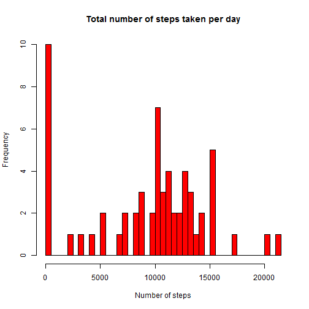
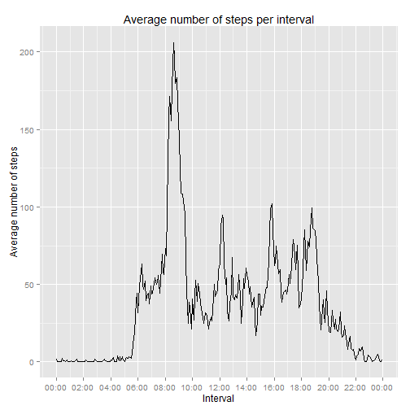
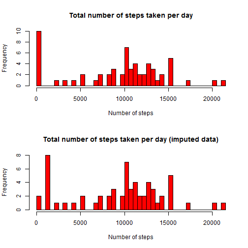
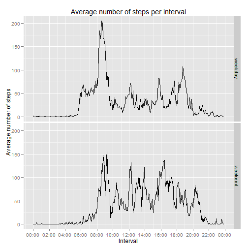

Reproducible Research: Peer Assessment 1
========================================================


## Introduction
This assignment makes use of data from a personal activity monitoring device. This device collects data at 5 minute intervals throughout the day. The data consist of two months of data from an anonymous individual collected during the months of October and November, 2012 and include the number of steps taken in 5 minute intervals each day.

The goal of the assignment is to perform some basic analysis on these data and report them in a reproducible manner.

## Loading and preprocessing the data
The data for this assignment can be downloaded directly from this repository as a [zip archive](https://github.com/amabelster/RepData_PeerAssessment1/blob/master/activity.zip). After downloading and unzipping the file to a "data" folder in the working directory, we can proceed to read in the data.

### Reading in the data
We first read in the data from the raw csv file included in the zip archive. The missing values in the data are coded as "NA".

```r
activity <- read.csv("data/activity.csv", stringsAsFactors = FALSE)
```

Let's take a quick look at the data:

```r
str(activity)
```

```
## 'data.frame':	17568 obs. of  3 variables:
##  $ steps   : int  NA NA NA NA NA NA NA NA NA NA ...
##  $ date    : chr  "2012-10-01" "2012-10-01" "2012-10-01" "2012-10-01" ...
##  $ interval: int  0 5 10 15 20 25 30 35 40 45 ...
```

As you can see, the data include three variables:

- `steps`: number of steps taken in a 5-minute interval (missing values are coded as NA),

- `date`: the date on which the measurement was taken in YYYY-MM-DD format,

- `interval`: identifier for the 5-minute interval in which the measurement was taken. It stores the value hh:mm as an integer, so for example 00:00 is stored as 0, and 21:15 as 2115.

### Preprocessing the data
To be able to work better with the `date` variable, we have to change its data type from **character** to **Date**:

```r
activity$date <- as.Date(activity$date, "%Y-%m-%d")
```
Now it has a more appropriate format:

```r
str(activity)
```

```
## 'data.frame':	17568 obs. of  3 variables:
##  $ steps   : int  NA NA NA NA NA NA NA NA NA NA ...
##  $ date    : Date, format: "2012-10-01" "2012-10-01" ...
##  $ interval: int  0 5 10 15 20 25 30 35 40 45 ...
```
Later on, we will analyze the activity patterns in weekdays and weekends, so we will need a factor variable with two levels ("weekday" and "weekend") indicating whether a given date is a weekday or weekend day. If your locale is not English, you will need to set it like this:

```r
Sys.setlocale("LC_TIME", "English")
```

```
## [1] "English_United States.1252"
```
Now we can create the factor variable `daytype` and look at the number of observations on weekday and weekend days:

```r
wdays <- weekdays(as.Date(activity$date, "%Y-%m-%d"))
activity$daytype <- "weekday"
activity$daytype[wdays == "Saturday" | wdays == "Sunday"] <- "weekend"
activity$daytype <- as.factor(activity$daytype)
table(activity$daytype)
```

```
## 
## weekday weekend 
##   12960    4608
```

Finally, the `interval` variable will be more readable with a "HH:MM" format. We can create a new variable in the dataset, called `time.interval`, of type POSIXct:

```r
activity$time.interval <- as.POSIXct(strptime(formatC(activity$interval, width = 4, format = "d", flag = "0"),"%H%M"))
```

I wasn't able to find a way to create this variable with only the values for hours and minutes, this method prefixes the hours and minutes with the current date. If you know how to avoid this behavior, I would very much like to know.

With this, the dataset is ready for the analysis. 

## What is the mean total number of steps taken per day?
For this part of the assignment, we will ignore the missing values in the dataset. First we will make a histogram of the total number of steps taken each day and then we will calculate the mean and median total number of steps taken per day.

To plot a histogram of the total number of steps taken per day we first need to calculate this variable, by adding the values of `steps` grouped by `date`:

```r
numsteps <- tapply(activity$steps, activity$date, sum, na.rm = TRUE)
hist(numsteps, breaks = 50, main = "Total number of steps taken per day", xlab = "Number of steps", col = "red")
```

 

We can easily compute the mean and median of this `numsteps` variable:

```r
mean(numsteps)
```

```
## [1] 9354
```

```r
median(numsteps)
```

```
## [1] 10395
```

The difference between the mean and the median might be due to the many days with zero steps registered. The histogram shows that there were 10 days with zero steps, and these low values affect the mean value. Maybe on these days the individual forgot to use the device to monitor his/her activity, or the device wasn't working correctly.

## What is the average daily activity pattern?
To analyse the average daily activity pattern, we will make a time series plot of the 5-minute interval and the average number of steps taken, averaged across all days. First we calculate the mean number of steps for each interval, across all days:

```r
mean.steps <- aggregate(steps ~ time.interval, data = activity, mean, na.rm = TRUE)
```

Now we can plot the time series using `ggplot2` and the `scales` library:

```r
library(ggplot2)
library(scales)
qplot(time.interval, steps, data = mean.steps, geom = "line", xlab = "Interval", ylab = "Average number of steps", main = "Average number of steps per interval") + scale_x_datetime(breaks = "120 min", labels = date_format("%H:%M"))
```

 

From this plot we can see that the 5-minute interval that contains the maximum number of steps, on average across all the days in the dataset, lies around 08:30 or 08:40 in the morning. But we can check this more precisely:

```r
max(mean.steps$steps)
```

```
## [1] 206.2
```

```r
format(mean.steps$time.interval[which.max(mean.steps$steps)], "%H:%M")
```

```
## [1] "08:35"
```

And quite true, the interval with the maximum average number of steps is 08:35, with about 206 steps on average.

## Imputing missing values
The presence of missing data may introduce bias into some calculations or summaries of the data. Until now we have ignored the missing data, but now we will fill them in using some representative value.

First we will calculate the total number of missing values in the dataset:

```r
sum(is.na(activity))
```

```
## [1] 2304
```

As we can see, there are 2304 observations with missing values in the dataset. This means that over 13% of the observations were ignored in our previous analysis.

Since we are going to fill in the missing data, it is important to choose a value that is somewhat representative of the interval for which we are imputing the value. It seems reasonable to use some kind of summary measure of the values for the same interval across the days where we have data. We would expect to find a similar activity level at the same time of the day. 

The mean or the median would be appropriate for this, but since the median is more robust (meaning that it is less affected by outliers) I will use the median of the values for a given interval across all days where data are available.

To do this I found very helpful the `plyr` library and this function proposed by Hadley Wickham [here](http://www.mail-archive.com/r-help@r-project.org/msg58289.html):

```r
library(plyr)
# function that performs imputation with a given function fun
impute <- function(x, fun) {
  missing <- is.na(x)
  replace(x, missing, fun(x[!missing]))
}
```

Now we will create a new dataset that is equal to the original dataset but with the missing data filled in:

```r
imp.activity <- ddply(activity, ~ interval, transform, steps = impute(steps, median))
```

Let's see whether the histogram of the total number of steps taken each day shows any difference with the histogram plotted ignoring the missing data:

```r
imp.numsteps <- tapply(imp.activity$steps, imp.activity$date, sum)
par(mfrow=c(2,1))
hist(numsteps, breaks = 50, main = "Total number of steps taken per day", xlab = "Number of steps", col = "red")
hist(imp.numsteps, breaks = 50, main = "Total number of steps taken per day (imputed data)", xlab = "Number of steps", col = "red")
```

 

It seems that the imputation affected mostly the days with zero steps, and now most of them have a total number of steps around 1000. This should increment the value of the mean total number of steps across days, but should not affect the median. Let's check this:

```r
mean(imp.numsteps)
```

```
## [1] 9504
```

```r
median(imp.numsteps)
```

```
## [1] 10395
```

As expected, the mean increased from 9354 to 9504, while the median remained unaffected.

## Are there differences in activity patterns between weekdays and weekends?
For this final part of the assignment we will use the dataset with the filled-in missing values. We will be using the factor variable `daytype` to analyse the activity patterns in weekdays and weekends.

We will make a time series plot similar to the one before, but now with the average number of steps taken, averaged across weekdays and weekends separately.

```r
mean.steps.daytype <- aggregate(steps ~ time.interval + daytype, data = imp.activity, mean)
qplot(time.interval, steps, data = mean.steps.daytype, group = daytype, geom = "line", xlab = "Interval", ylab = "Average number of steps", main = "Average number of steps per interval") + scale_x_datetime(breaks = "120 min", labels = date_format("%H:%M")) + facet_grid(daytype ~ .)
```

 

As we can see in these plots, there are differences in the activity patterns between weekdays and weekends. On weekdays the individual wakes up earlier, between 06:00 and 08:00 there is a mean of around 50-60 steps on each 5-minute interval. On weekends it seems that the individual stays in bed until around 08:00. 

Also, on weekdays there is a clear peak in activity between 08:00 and 09:00, with a peak average of over 200 steps at 08:35. The rest of the day the activity level is quite lower, below 100 steps per 5-minute interval on average. On weekends there is no clear peak in the activity levels, but the individual remains active the whole day.

Finally, there are also differences at the end of the day. On weekdays the individual remains mostly inactive from 20:00 onwards, probably because he/she has returned home and stays there for the night. On weekends the individual has higher activity levels until about 22:00.
